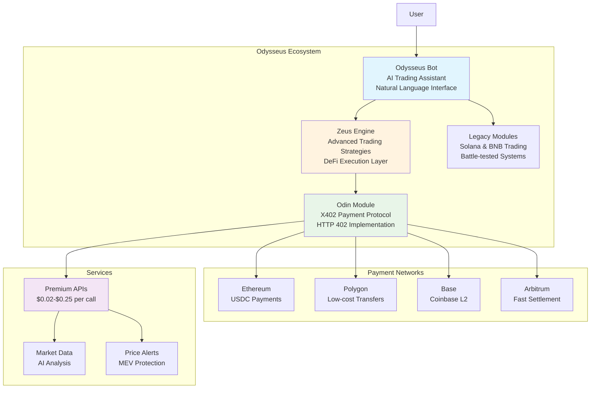
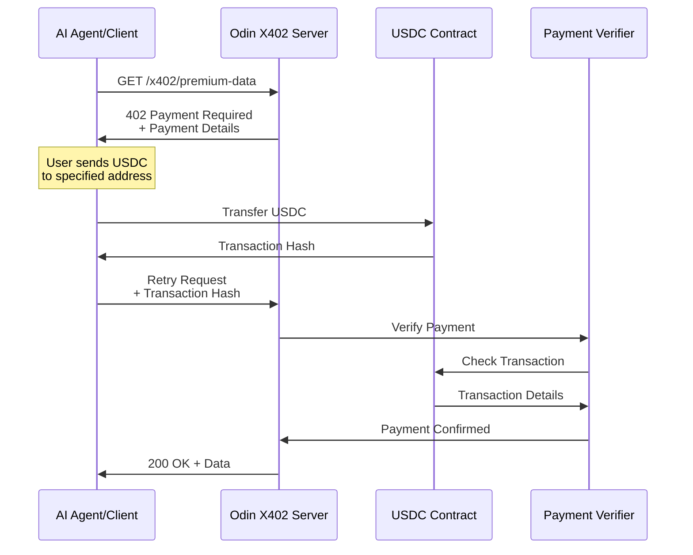
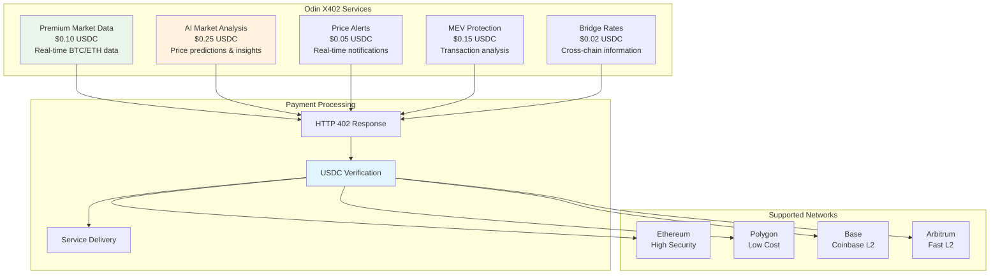
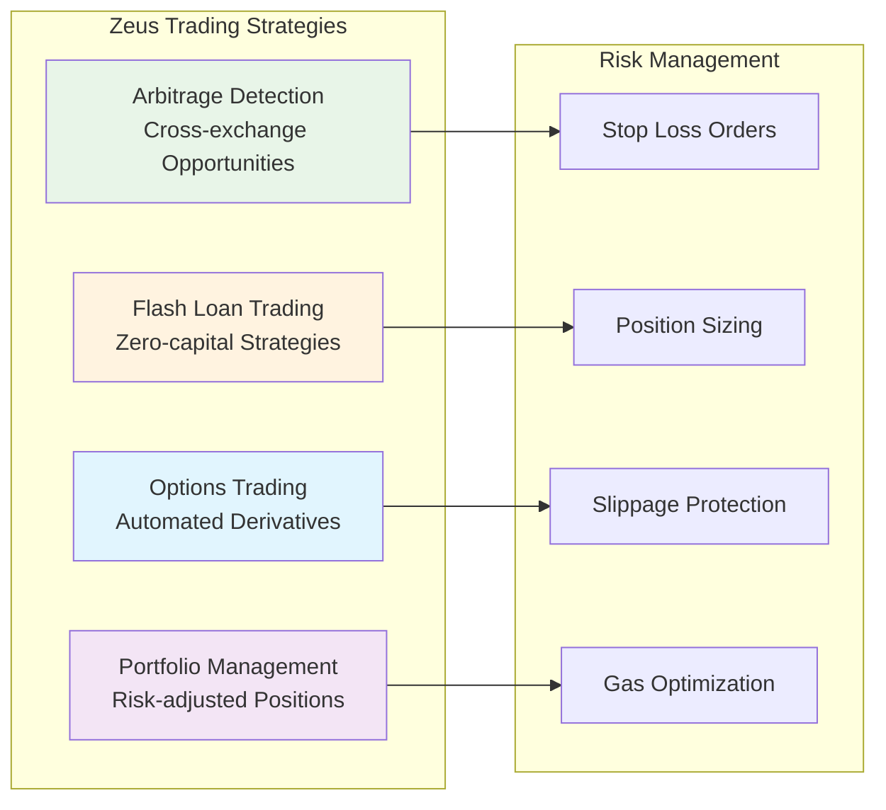
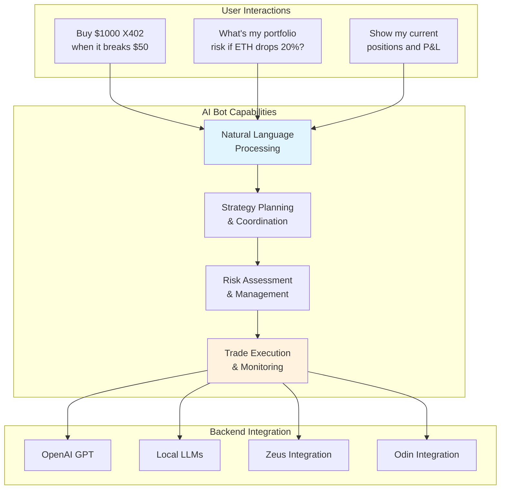
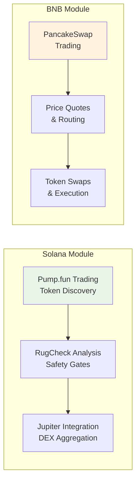
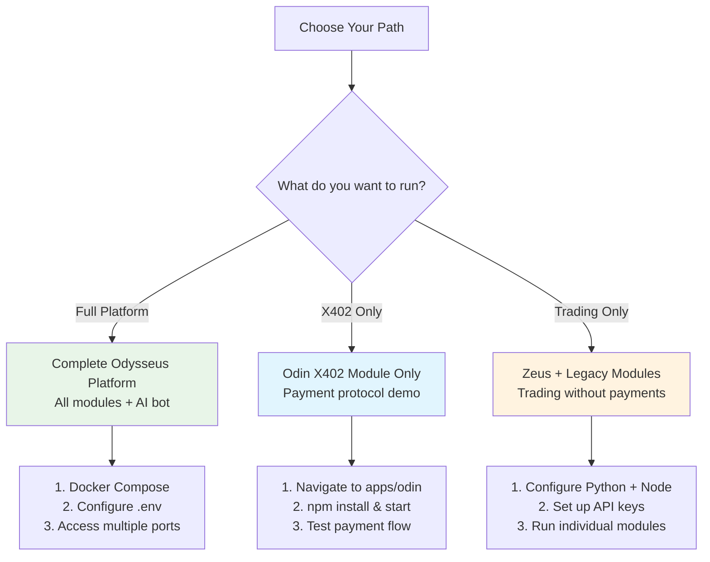
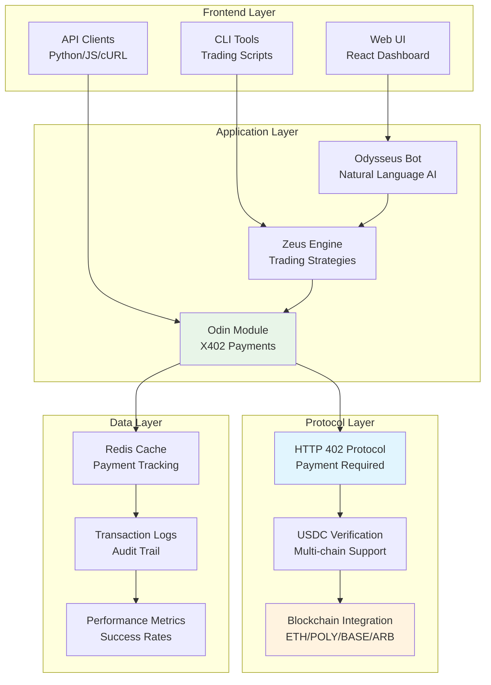
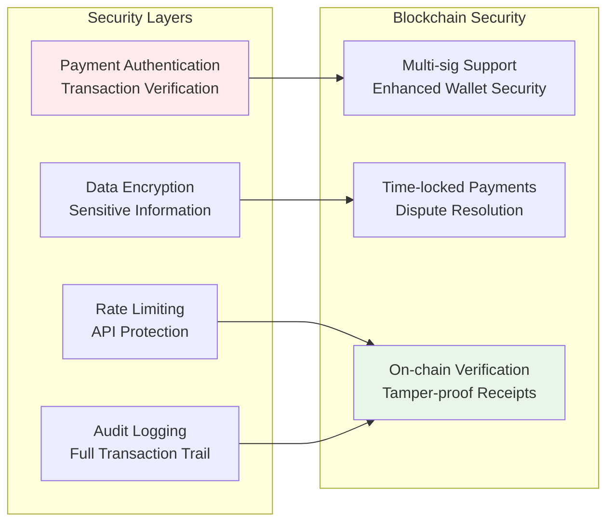

#The Odysseus Collective

**AI-Powered Trading with X402 Payment Protocol Integration**

*Combining Odysseus AI Bot, Zeus Trading Engine, and Odin X402 Payment Protocol*

## Platform Overview

Odysseus is a comprehensive AI trading platform that integrates Coinbase's X402 payment protocol for next-generation machine-to-machine payments. The platform enables AI agents to autonomously pay for premium trading services using USDC micropayments across multiple blockchain networks.



## What is X402?

**X402** is Coinbase's open-source payment protocol that uses the HTTP 402 "Payment Required" status code to enable programmatic payments. It allows AI agents and users to pay for web services using stablecoins directly within the web request flow.

### How X402 Works



### Key Features
- **AI-friendly**: Designed for autonomous AI agents to handle payments without human intervention
- **Programmatic**: Allows for pay-per-use billing and micropayments for services
- **Instant**: Processes payments directly on-chain within the HTTP flow
- **Decentralized**: Funds go directly to the recipient's web3 wallet
- **Open-source**: The protocol is open and can be built upon by anyone

## Platform Components

### Odin X402 Payment Module

The core X402 protocol implementation providing HTTP 402 payment functionality.



**Live Demo**: http://localhost:9999 (when running)

### Zeus Trading Engine

Advanced DeFi trading strategies and execution layer.



### Odysseus AI Bot

Natural language interface for complex trading operations.



### Legacy Trading Modules

Battle-tested trading systems for specific chains.



## Getting Started

### Quick Start Options



### Full Platform Deployment

```bash
# Clone the repository
git clone https://github.com/jconstantine627752-maker/Odysseus.git
cd Odysseus

# Configure environment
cp .env.example .env
# Edit .env with your API keys and wallet addresses

# Start all services
docker-compose up --build

# Access points:
# Odysseus Bot: http://localhost:3000
# Zeus API: http://localhost:9999  
# Odin X402: http://localhost:9999
# Legacy Solana: http://localhost:8000
```

### Odin X402 Module Only

Perfect for testing the X402 payment protocol:

```bash
# Navigate to Odin module
cd apps/odin

# Install dependencies
npm install

# Configure environment
cp .env.example .env
# Add your blockchain RPC URLs and payment recipient address

# Start the server
npm run build && npm start

# Open demo at: http://localhost:9999
```

### Environment Configuration

#### For X402 Payment Protocol:
```env
# Payment Configuration
PAYMENT_RECIPIENT_ADDRESS=0x742d35Cc6634C0532925a3b8D6Ac0d449Fc30819
DEFAULT_PAYMENT_NETWORK=base

# Blockchain RPC URLs (for payment verification)
ETHEREUM_RPC_URL=https://eth-mainnet.g.alchemy.com/v2/your-api-key
POLYGON_RPC_URL=https://polygon-mainnet.g.alchemy.com/v2/your-api-key
BASE_RPC_URL=https://base-mainnet.g.alchemy.com/v2/your-api-key
ARBITRUM_RPC_URL=https://arb-mainnet.g.alchemy.com/v2/your-api-key
```

#### For Trading Modules:
```env
# Solana Configuration
SOLANA_RPC_URL=https://api.mainnet-beta.solana.com
WALLET_PRIVATE_KEY=your_solana_private_key

# BNB Chain Configuration  
BSC_RPC_URL=https://bsc-dataseed.binance.org
BNB_PRIVATE_KEY=your_bnb_private_key

# API Keys
PUMPPORTAL_API_KEY=your_api_key
BITQUERY_API_KEY=your_api_key
RUGCHECK_API_KEY=your_api_key
```

## X402 Use Cases & Demo

### Available Services

| Service | Price | Description |
|---------|-------|-------------|
| **Premium Market Data** | $0.10 USDC | Real-time BTC/ETH data with arbitrage opportunities |
| **AI Market Analysis** | $0.25 USDC | AI-powered price predictions and trading signals |
| **Price Alerts** | $0.05 USDC | Real-time notifications with sub-second latency |
| **MEV Protection** | $0.15 USDC | Transaction analysis and protection strategies |
| **Bridge Rates** | $0.02 USDC | Cross-chain transfer costs and time estimates |

### How to Test X402

1. **Start Odin server**: `cd apps/odin && npm start`
2. **Open demo UI**: http://localhost:9999
3. **Try a service**: Click any "Try" button
4. **Get 402 response**: Server returns payment details
5. **Send USDC**: Transfer to the provided address
6. **Verify payment**: Paste transaction hash
7. **Receive service**: Data delivered automatically

### Integration Examples

#### Python Client
```python
import requests

# Request premium data
response = requests.get('http://localhost:9999/x402/premium-data')

if response.status_code == 402:
    payment_info = response.json()['paymentRequest']
    print(f"Payment required: {payment_info['amount']} USDC")
    print(f"Send to: {payment_info['recipient']}")
    
    # After sending payment...
    tx_hash = input("Enter transaction hash: ")
    
    # Retry with payment proof
    headers = {
        'x-payment-id': payment_info['paymentId'],
        'x-payment-proof': json.dumps({
            'transactionHash': tx_hash,
            'network': payment_info['network']
        })
    }
    
    data_response = requests.get('http://localhost:9999/x402/premium-data', headers=headers)
    print(data_response.json())
```

#### JavaScript/Node.js Client
```javascript
const axios = require('axios');

async function getPremiumData() {
    try {
        const response = await axios.get('http://localhost:9999/x402/premium-data');
        return response.data;
    } catch (error) {
        if (error.response?.status === 402) {
            const paymentRequest = error.response.data.paymentRequest;
            console.log(`Payment required: ${paymentRequest.amount} USDC`);
            console.log(`Send to: ${paymentRequest.recipient}`);
            
            // After payment, retry with proof
            const txHash = prompt('Enter transaction hash:');
            
            const retryResponse = await axios.get('http://localhost:9999/x402/premium-data', {
                headers: {
                    'x-payment-id': paymentRequest.paymentId,
                    'x-payment-proof': JSON.stringify({
                        transactionHash: txHash,
                        network: paymentRequest.network
                    })
                }
            });
            
            return retryResponse.data;
        }
        throw error;
    }
}
```

## Architecture Deep Dive

### System Architecture



### Security Features



## Development & Deployment

### Docker Deployment

The platform includes comprehensive Docker support:

```yaml
# docker-compose.yml structure
services:
  odysseus-bot:     # AI Trading Assistant
  zeus-engine:      # Trading Strategies  
  odin-x402:        # Payment Protocol
  solana-bot:       # Legacy Solana Module
  bnb-service:      # Legacy BNB Module
  redis:            # Caching Layer
```

### Testing

```bash
# Test X402 payment protocol
cd apps/odin
npm test

# Test trading modules
python -m pytest tests/

# Integration testing
./test-integration.sh
```

### Monitoring

Built-in monitoring for all components:

- **Payment Success Rates**: Track X402 transaction verification
- **Trading Performance**: Monitor strategy profitability  
- **System Health**: API response times and error rates
- **Blockchain Status**: Network congestion and gas prices

## Contributing

We welcome contributions to the Odysseus platform:

1. **Fork the repository**
2. **Create a feature branch**: `git checkout -b feature/new-x402-service`
3. **Make your changes** and add tests
4. **Submit a pull request** with detailed description

### Areas for Contribution

- **New X402 Services**: Add more pay-per-use API endpoints
- **Trading Strategies**: Implement new Zeus trading algorithms
- **Blockchain Support**: Add more networks to X402 payment verification
- **UI Improvements**: Enhance the demo interface and dashboards
- **Documentation**: Improve guides and API documentation

## License

MIT License © 2025 Odysseus Collective

The Odysseus platform is open-source software that enables the future of AI-driven trading with blockchain-native payments. Build upon it, extend it, and contribute back to the ecosystem.

---

**Ready to start?** Choose your deployment option above and join the future of AI trading with X402 payments!
