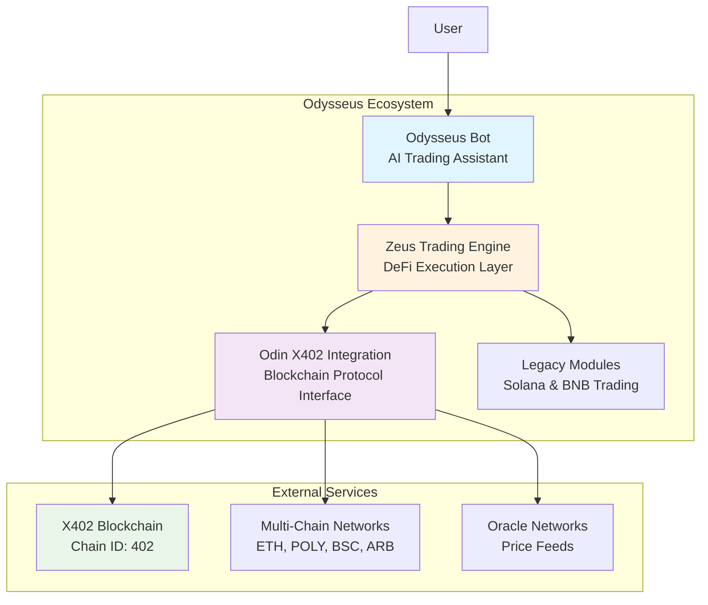
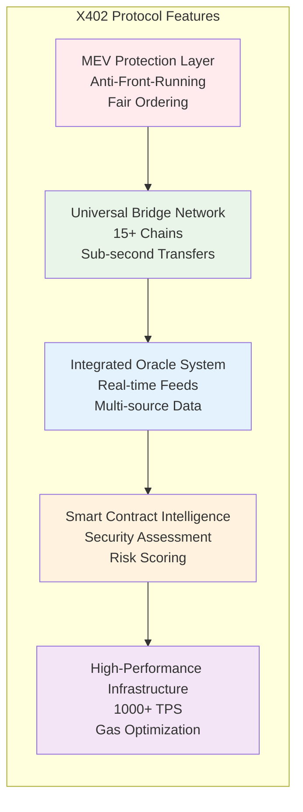
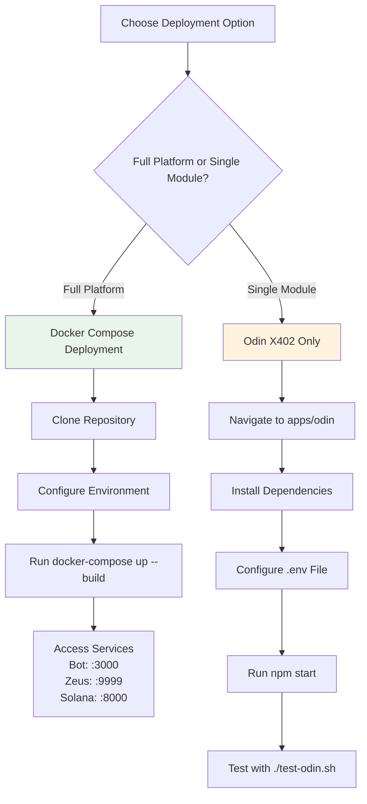
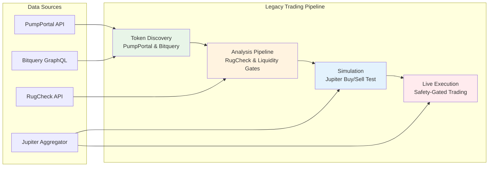

# Odysseus Collective

**Next-Generation AI & X402 Blockchain Trading Platform**
*Combining Odysseus AI Bot, Zeus Trading Engine, and Odin X402 Protocol Integration*

## Overview

Odysseus is a comprehensive trading platform that bridges conversational AI with advanced DeFi protocols. The platform integrates with the revolutionary **X402 blockchain** to provide MEV-protected trading, cross-chain arbitrage, and institutional-grade portfolio management through natural language interactions.

### Platform Architecture



### Platform Components:

**Odysseus Bot** – Your AI trading assistant with natural language interface
- OpenAI-compatible chat API for complex strategy discussions
- Intelligent trade execution based on market analysis
- Real-time portfolio monitoring and risk alerts
- Multi-chain strategy coordination

**Zeus Trading Engine** – High-performance DeFi execution layer  
- Advanced arbitrage detection and execution
- Flash loan strategies with zero capital requirements
- Options trading and complex derivatives strategies
- Cross-chain portfolio rebalancing

**Odin X402 Integration** – Next-gen blockchain protocol interface
- Native X402 protocol integration with Chain ID 402
- Cross-chain bridge operations to 15+ networks
- Built-in MEV protection and oracle aggregation
- Smart contract security analysis and liquidity monitoring

**Legacy Modules** – Battle-tested trading systems
- Solana Bot for Pump.fun token strategies
- BNB Chain microservice for BSC trading
- Unified Docker deployment across all environments

## What is X402 Integration?

**X402** (Chain ID: 402) is a revolutionary blockchain protocol designed specifically for advanced DeFi operations. Unlike traditional blockchains, X402 provides native infrastructure for professional trading:



### MEV Protection Layer
- Built-in protection against front-running and sandwich attacks
- Fair ordering mechanisms for all transactions
- Trader-first design philosophy

### Universal Bridge Network
- Native bridges to 15+ major blockchains (Ethereum, Polygon, BSC, Arbitrum, etc.)
- Sub-second cross-chain transfers with minimal fees
- Automated liquidity routing across networks

### Integrated Oracle System
- Decentralized price feeds with sub-second updates
- Multi-source price aggregation for maximum accuracy
- Built-in volatility and liquidity metrics

### Smart Contract Intelligence
- Automated security assessment for new protocols
- Real-time liquidity analysis across all X402 DeFi protocols
- Risk scoring and safety recommendations

### High-Performance Infrastructure
- 1000+ TPS with deterministic finality
- Intelligent gas optimization and transaction batching
- Purpose-built for algorithmic trading strategies

**Why X402 Matters**: Traditional blockchains were built for general use. X402 is purpose-built for DeFi, providing the infrastructure that professional traders and institutions need to compete in modern markets.

## Getting Started



### Quick Start - Full Platform
```bash
# Clone and start the entire Odysseus ecosystem
git clone <repository>
cd Odysseus
cp .env.example .env
docker-compose up --build

# Access points:
# Odysseus Bot UI: http://localhost:3000
# Zeus Trading API: http://localhost:9999
# Legacy Solana Bot: http://localhost:8000
```

### Odin X402 Module Only
```bash
cd apps/odin
npm install
cp .env.example .env
# Edit .env with your X402 RPC endpoint and API keys
npm start

# Test X402 integration:
./test-odin.sh
```

---

## 1. Odysseus AI Bot

Your conversational AI trading assistant that makes complex DeFi strategies accessible through natural language.

```mermaid
graph TD
    subgraph "Odysseus AI Bot Architecture"
        UI[Web UI Interface]
        API[OpenAI-Compatible API]
        NLP[Natural Language Processing]
        STRAT[Strategy Coordination]
        RISK[Risk Management]
        EXEC[Execution Engine]
    end
    
    subgraph "Backend Integrations"
        OPENAI[OpenAI GPT]
        LOCAL[Local LLMs]
        HOSTED[Hosted Models]
    end
    
    subgraph "Trading Systems"
        ZEUS[Zeus Trading Engine]
        ODIN[Odin X402 Module]
        LEGACY[Legacy Modules]
    end
    
    USER[User Input<br/>"Buy $1000 X402"] --> UI
    UI --> API
    API --> NLP
    NLP --> STRAT
    STRAT --> RISK
    RISK --> EXEC
    
    API --> OPENAI
    API --> LOCAL
    API --> HOSTED
    
    EXEC --> ZEUS
    EXEC --> ODIN
    EXEC --> LEGACY
    
    style UI fill:#e1f5fe
    style EXEC fill:#fff3e0
```

### Features
- **Natural Language Trading**: "Buy $1000 of X402 when it breaks resistance"
- **Intelligent Strategy Coordination**: Manages Zeus trading engine and Odin X402 integration
- **Real-time Market Analysis**: Continuous monitoring with AI-powered insights
- **Risk Management Conversations**: "What's my portfolio risk if X402 drops 20%?"
- **Cross-chain Coordination**: Seamlessly manage positions across multiple networks

### API Integration
- OpenAI-compatible chat API for easy integration
- Pluggable backends (OpenAI, local LLMs, hosted models)
- Direct integration with Zeus trading engine and Odin X402 module
- RESTful endpoints for programmatic access

### Quick Start
```bash
cp .env.example .env
docker compose up --build
# Odysseus Bot UI: http://localhost:3000
# Chat API: http://localhost:8080/v1/chat/completions
```

---

## 2. Legacy Trading Modules



### Solana Bot - Pump.fun Strategy Engine

A deterministic, safety-gated trading framework for Pump.fun tokens.
LLM sentiment is optional — all executions follow strict, rule-based checks.

 Pipeline

Discover new tokens from PumpPortal or Bitquery

Apply RugCheck + liquidity + top-holder gates

Simulate buy→sell via Jupiter

Execute live trade only if all gates pass

 Setup
python -m venv .venv && source .venv/bin/activate
pip install -r requirements.txt
cp .env.example .env


Run simulation mode (no TX):

python -m src.main --paper


Run live (requires WALLET_PRIVATE_KEY):

python -m src.main --live


Dockerized

docker compose up --build solana


Configuration

SOLANA_RPC_URL=...
RUGCHECK_API_KEY=...
TEST_BUY_USD=10
MAX_POSITION_USD=100
MIN_LIQ_SOL=5
MAX_TOP5_PCT=40


Safety Gates

 Authorities revoked

 RugCheck ≤ medium risk

 Liquidity and top-holder thresholds

 Simulated buy→sell test

 Local key signing

 3. Odysseus BNB Module

A standalone Node.js microservice that performs quotes and swaps on BNB Chain using PancakeSwap/UniswapV2 routers.
It’s chain-agnostic and callable from any backend or chatbot.

 Quick Start
cd odysseus-bnb
cp .env.example .env
npm install
npm run build
npm start


Or via Docker:

docker build -t odysseus-bnb .
docker run --rm -it --env-file .env -p 8787:8787 odysseus-bnb

 API Endpoints

Health

GET /health


Quote

GET /quote?base=<erc20>&quote=<erc20>&amount=<human>


Swap Tokens

POST /swap/tokens
{
  "base": "0x...",
  "quote": "0x...",
  "amount": "1.0",
  "slippageBps": 50
}


Swap BNB

POST /swap/eth
{
  "quote": "0x...",
  "amountInEth": "0.05",
  "slippageBps": 50
}


Sample .env

BSC_RPC_URL=https://bsc-dataseed.binance.org
PRIVATE_KEY=0xYOUR_BURNER_KEY
ROUTER_ADDRESS=0x10ED43C718714eb63d5aA57B78B54704E256024E
WBNB_ADDRESS=0xBB4CdB9CBd36B01bD1cBaEBF2De08d9173bc095c
PORT=8787
SLIPPAGE_BPS_DEFAULT=50

 4. Integrating Odysseus with Your Chatbot

Your chatbot or backend can invoke Odysseus services directly over HTTP.

Example (Python):

import requests

resp = requests.get(
    "http://localhost:8787/quote",
    params={
        "base": "0xbb4cdb9cbd36b01bd1cbaebf2de08d9173bc095c",
        "quote": "0xe9e7cea3dedca5984780bafc599bd69add087d56",
        "amount": "1"
    }
)
print(resp.json())


Solana Paper Mode:

python -m src.main --paper

 Architecture
odysseus/
├── agents/                # Chat + orchestration
├── solana-bot/            # Pump.fun trading bot
├── odysseus-bnb/          # BNB microservice
└── docker-compose.yml     # Unified deployment

Service	Port	Description
agent	8080	Chat/LLM API
solana	5174	Solana Trader
bnb	8787	BNB Trader
Security Checklist

Use burner wallets for all chains

Verify router and wrapped-token addresses

Keep .env private (never commit keys)

Monitor TXs for gas and slippage

Implement global circuit breakers

 License

MIT License © 2025 Odysseus Collective

Permission is hereby granted, free of charge, to any person obtaining a copy
of this software and associated documentation files (the “Software”), to deal
in the Software without restriction, including without limitation the rights
to use, copy, modify, merge, publish, distribute, sublicense, and/or sell
copies of the Software, and to permit persons to whom the Software is
furnished to do so, subject to the following conditions:

The above copyright notice and this permission notice shall be included
in all copies or substantial portions of the Software.

THE SOFTWARE IS PROVIDED “AS IS”, WITHOUT WARRANTY OF ANY KIND, EXPRESS OR
IMPLIED, INCLUDING BUT NOT LIMITED TO THE WARRANTIES OF MERCHANTABILITY,
FITNESS FOR A PARTICULAR PURPOSE AND NONINFRINGEMENT. IN NO EVENT SHALL
THE AUTHORS OR COPYRIGHT HOLDERS BE LIABLE FOR ANY CLAIM, DAMAGES OR OTHER
LIABILITY, WHETHER IN AN ACTION OF CONTRACT, TORT OR OTHERWISE, ARISING FROM,
OUT OF OR IN CONNECTION WITH THE SOFTWARE OR THE USE OR OTHER DEALINGS IN THE
SOFTWARE.
