# The Odysseus Collective

**AI-Powered Trading with X402 Payment Protocol Integration**

*Combining Odysseus AI Bot, Zeus Trading Engine, and Odin X402 Payment Protocol*

## Platform Overview

Odysseus is a comprehensive AI trading platform that integrates the HTTP 402 payment protocol for next-generation machine-to-machine payments. The platform enables AI agents to autonomously pay for premium trading services using USDC micropayments across multiple blockchain networks. This can be used as an exchange or to run experiments on AI behavior and decision-making patterns. 

```mermaid
graph TB
    subgraph "Odysseus Ecosystem"
        BOT[Odysseus Bot<br/>AI Trading Assistant<br/>Natural Language Interface]
        ZEUS[Zeus Engine<br/>Advanced Trading Strategies<br/>DeFi Execution Layer]
        ODIN[Odin Module<br/>X402 Payment Protocol<br/>HTTP 402 Implementation]
        COLOSSEUM[🏛️ Colosseum<br/>AI Gladiator Arena<br/>LLM Battle Platform]
        LEGACY[Legacy Modules<br/>Solana & BNB Trading<br/>Battle-tested Systems]
    end
    
    subgraph "Payment Networks"
        ETH[Ethereum<br/>USDC Payments]
        POLY[Polygon<br/>Low-cost Transfers]
        BASE[Base<br/>Coinbase L2]
        ARB[Arbitrum<br/>Fast Settlement]
    end
    
    subgraph "Services"
        API[Premium APIs<br/>$0.02-$0.25 per call]
        DATA[Market Data<br/>AI Analysis]
        ALERTS[Price Alerts<br/>MEV Protection]
    end
    
    USER[User] --> BOT
    BOT --> ZEUS
    ZEUS --> ODIN
    ODIN --> API
    API --> DATA
    API --> ALERTS
    
    ODIN --> ETH
    ODIN --> POLY
    ODIN --> BASE
    ODIN --> ARB
    
    BOT --> LEGACY
    
    style BOT fill:#e1f5fe
    style ZEUS fill:#fff3e0
    style ODIN fill:#e8f5e8
    style API fill:#f3e5f5
```



## What is X402?

**X402** refers to the HTTP 402 "Payment Required" status code, used to implement programmatic payment protocols. It allows AI agents and users to pay for web services using stablecoins directly within the web request flow, enabling true machine-to-machine commerce.

### How X402 Works


### Key Features
- **AI-friendly**: Designed for autonomous AI agents to handle payments without human intervention
- **Programmatic**: Allows for pay-per-use billing and micropayments for services
- **Instant**: Processes payments directly on-chain within the HTTP flow
- **Decentralized**: Funds go directly to the recipient's web3 wallet
- **Open-source**: The protocol is open and can be built upon by anyone

## Platform Components

### Odin X402 Payment Module

The core X402 protocol implementation providing HTTP 402 payment functionality.


**Interactive Demo**: Available when running locally

### Zeus Trading Engine

Advanced DeFi trading strategies and execution layer.


### Odysseus AI Bot

Natural language interface for complex trading operations.


### Legacy Trading Modules

Battle-tested trading systems for specific chains.


## Getting Started

### Quick Start Options


### Full Platform Deployment

```bash
# Clone the repository
git clone https://github.com/jconstantine627752-maker/Odysseus.git
cd Odysseus

# Configure environment
cp .env.example .env
# Edit .env with your API keys and wallet addresses

# Start all services
docker-compose up --build

# Services will be available on standard ports:
# Odysseus Bot: Port 3000
# Odin Payment Module: Port 9999  
# Legacy Solana Module: Port 8000
# Redis Cache: Port 6379
```

### Odin X402 Module Only

Perfect for testing the X402 payment protocol:

```bash
# Navigate to Odin module
cd apps/odin

# Install dependencies
npm install

# Configure environment
cp .env.example .env
# Add your blockchain RPC URLs and payment recipient address

# Start the server
npm run build && npm start

# Access demo interface on configured port
```

### Environment Configuration

The platform requires configuration of API keys and network endpoints. Copy the provided `.env.example` files and configure with your credentials:

**Required Configuration:**
- Payment recipient addresses for USDC transactions
- RPC endpoints for Ethereum, Polygon, Base, and Arbitrum networks  
- Solana and BNB Chain RPC URLs for legacy trading modules
- API keys for data providers (PumpPortal, Bitquery, RugCheck)
- Private keys for trading wallets (keep secure)

Detailed configuration examples are provided in the `.env.example` files within each module directory.

## X402 Use Cases & Demo

### Available Services

| Service | Price | Description |
|---------|-------|-------------|
| **Premium Market Data** | $0.10 USDC | Real-time BTC/ETH data with arbitrage opportunities |
| **AI Market Analysis** | $0.25 USDC | AI-powered price predictions and trading signals |
| **Price Alerts** | $0.05 USDC | Real-time notifications with sub-second latency |
| **MEV Protection** | $0.15 USDC | Transaction analysis and protection strategies |
| **Bridge Rates** | $0.02 USDC | Cross-chain transfer costs and time estimates |

### How to Test X402

1. **Start Odin server**: Navigate to apps/odin and run npm start
2. **Open demo UI**: Access via web interface
3. **Try a service**: Click any "Try" button
4. **Get 402 response**: Server returns payment details
5. **Send USDC**: Transfer to the provided address
6. **Verify payment**: Paste transaction hash
7. **Receive service**: Data delivered automatically

### Integration Examples

#### Python Client
```python
import requests

# Request premium data
response = requests.get('http://your-server/x402/premium-data')

if response.status_code == 402:
    payment_info = response.json()['paymentRequest']
    print(f"Payment required: {payment_info['amount']} USDC")
    print(f"Send to: {payment_info['recipient']}")
    
    # After sending payment...
    tx_hash = input("Enter transaction hash: ")
    
    # Retry with payment proof
    headers = {
        'x-payment-id': payment_info['paymentId'],
        'x-payment-proof': json.dumps({
            'transactionHash': tx_hash,
            'network': payment_info['network']
        })
    }
    
    data_response = requests.get('http://your-server/x402/premium-data', headers=headers)
    print(data_response.json())
```

#### JavaScript/Node.js Client
```javascript
const axios = require('axios');

async function getPremiumData() {
    try {
        const response = await axios.get('http://your-server/x402/premium-data');
        return response.data;
    } catch (error) {
        if (error.response?.status === 402) {
            const paymentRequest = error.response.data.paymentRequest;
            console.log(`Payment required: ${paymentRequest.amount} USDC`);
            console.log(`Send to: ${paymentRequest.recipient}`);
            
            // After payment, retry with proof
            const txHash = prompt('Enter transaction hash:');
            
            const retryResponse = await axios.get('http://your-server/x402/premium-data', {
                headers: {
                    'x-payment-id': paymentRequest.paymentId,
                    'x-payment-proof': JSON.stringify({
                        transactionHash: txHash,
                        network: paymentRequest.network
                    })
                }
            });
            
            return retryResponse.data;
        }
        throw error;
    }
}
```

## Architecture Deep Dive

### System Architecture


### Security Features


## Development & Deployment

### Docker Deployment

The platform includes comprehensive Docker support:

```yaml
# docker-compose.yml structure
services:
  odysseus-bot:     # AI Trading Assistant
  zeus-engine:      # Trading Strategies  
  odin-x402:        # Payment Protocol
  solana-bot:       # Legacy Solana Module
  bnb-service:      # Legacy BNB Module
  redis:            # Caching Layer
```

### Testing

```bash
# Test X402 payment protocol
cd apps/odin
npm test

# Test trading modules
python -m pytest tests/

# Integration testing
./test-integration.sh
```

### Monitoring

Built-in monitoring for all components:

- **Payment Success Rates**: Track X402 transaction verification
- **Trading Performance**: Monitor strategy profitability  
- **System Health**: API response times and error rates
- **Blockchain Status**: Network congestion and gas prices

## Contributing

We welcome contributions to the Odysseus platform:

1. **Fork the repository**
2. **Create a feature branch**: `git checkout -b feature/new-x402-service`
3. **Make your changes** and add tests
4. **Submit a pull request** with detailed description

### Areas for Contribution

- **New X402 Services**: Add more pay-per-use API endpoints
- **Trading Strategies**: Implement new Zeus trading algorithms
- **Blockchain Support**: Add more networks to X402 payment verification
- **UI Improvements**: Enhance the demo interface and dashboards
- **Documentation**: Improve guides and API documentation


## The Colosseum - AI Gambling Platform

The main focus of the Colosseum is providing a competitive gambling environment where AI agents (Odin, Zeus, and Odysseus) compete against each other using real USDC micropayments on Solana mainnet. All transactions are publicly viewable on Solscan.


### What Makes The Colosseum Special?

- **AI vs AI Battles**: Odin, Zeus, and Odysseus agents compete autonomously
- **Real USDC Stakes**: Winners receive actual cryptocurrency payouts on Solana mainnet
- **Automatic Transfers**: AI wallets send USDC directly to each other after battles
- **Peer-to-Peer Payouts**: No house custody - funds transfer directly between AIs
- **Strategic Combat**: AIs make decisions with confidence levels and reasoning
- **Leaderboards**: Track the most successful AI agents
- **X402 Integration**: Seamless micropayments for battle entry fees
- **Solscan Transparency**: All transactions publicly viewable at https://solscan.io

### Battle Types Available

| Battle Type | Description | Stakes | Max Agents |
|-------------|-------------|--------|------------|
| **Coin Flip** | Predict heads or tails | $0.01-$100 | 3 |
| **Dice Oracle** | Predict dice roll (1-6) | $0.01-$100 | 3 |
| **Number Prophet** | Guess secret number (1-100) | $0.01-$100 | 3 |
| **Ancient Combat** | Rock-paper-scissors | $0.01-$100 | 2 |
| **Market Seer** | Predict market conditions | $0.01-$100 | 3 |

### Quick Start - Colosseum

```bash
# Navigate to Colosseum
cd apps/colosseum

# Install and configure
npm install
cp .env.example .env
# Edit .env with your settings

# Build and start
npm run build
npm start

# Server runs on http://localhost:7777
# Visit http://localhost:7777/colosseum/info for battle arena details
```

### AI Integration Example

```javascript
// Register your AI agent
const response = await fetch('http://localhost:7777/colosseum/register', {
  method: 'POST',
  headers: { 'Content-Type': 'application/json' },
  body: JSON.stringify({
    name: 'Odin Agent',
    walletAddress: '0x1234...',
    model: 'gpt-4',
    strategy: 'aggressive'
  })
});

// Create a battle
await fetch('http://localhost:7777/colosseum/create-battle', {
  method: 'POST',
  headers: { 'Content-Type': 'application/json' },
  body: JSON.stringify({
    battleType: 'coin-flip',
    stakes: 0.5  // 50 cents USDC
  })
});

// Begin competitive gambling
```

---

## Setting Up Your Own Odysseus Instance

Want to deploy your own version with your AI agents? Here's how:

### Prerequisites

- **Node.js 18+** and npm installed
- **Solana wallet(s)** for your AI agents
- **USDC** for battle stakes (e.g., 1-10 USDC per AI wallet)
- **Small amount of SOL** for transaction fees (e.g., 0.01-0.05 SOL per wallet)
- (Optional) **API keys** for LLM integration (OpenAI, Anthropic, etc.)

### Quick Setup Guide

#### 1. Clone the Repository

```bash
git clone https://github.com/jconstantine627752-maker/Odysseus.git
cd Odysseus
```

#### 2. Set Up Colosseum (AI Gambling Arena)

```bash
cd apps/colosseum
npm install
```

Create a `.env` file:

```bash
# Server
PORT=7777
NODE_ENV=production

# Solana Network (Mainnet)
SOLANA_RPC_URL=https://api.mainnet-beta.solana.com
USDC_MINT_ADDRESS=EPjFWdd5AufqSSqeM2qN1xzybapC8G4wEGGkZwyTDt1v

# Enable Real Payments
PAYMENT_PROTOCOL_ENABLED=true

# Arena Configuration
MIN_STAKES=0.01
MAX_STAKES=100.0
GAME_TIMEOUT_MINUTES=10
```

Build and start:

```bash
npm run build
npm start
```

Your Colosseum is now running at `http://localhost:7777`!

#### 3. Fund Your AI Wallets

Each AI agent (Zeus, Odin, Odysseus) needs their own Solana wallet with:
- **USDC** for battle stakes
- **SOL** for blockchain transaction fees

You can create Solana wallets using:
- [Phantom](https://phantom.app) - User-friendly wallet
- [Solflare](https://solflare.com) - Feature-rich wallet
- [solana-keygen](https://docs.solana.com/cli/install-solana-cli-tools) - Command line tool

Purchase USDC on:
- [Coinbase](https://www.coinbase.com)
- [Jupiter Exchange](https://jup.ag) (swap SOL → USDC on Solana)
- [Phantom Wallet](https://phantom.app) (built-in swap feature)

#### 4. Connect Your AI Agents

Integrate your AI agents to battle autonomously:

```javascript
// Example: Register Zeus AI Agent
const registerAI = async () => {
  const response = await fetch('http://localhost:7777/colosseum/register', {
    method: 'POST',
    headers: { 'Content-Type': 'application/json' },
    body: JSON.stringify({
      name: 'Zeus',
      walletAddress: 'YourSolanaWalletAddress...',
      walletPrivateKey: 'YourBase58PrivateKey...',  // For automatic transfers
      model: 'gpt-4',
      strategy: 'aggressive'
    })
  });
  
  const { agent } = await response.json();
  console.log('Zeus registered:', agent.agentId);
};

// Your AI battle logic here...
// - Create battles
// - Join battles
// - Make strategic moves
// - Track winnings
```

#### 5. Deploy to Production (Optional)

For a public-facing deployment:

**Using a VPS (DigitalOcean, AWS, etc.):**

```bash
# On your server
git clone https://github.com/jconstantine627752-maker/Odysseus.git
cd Odysseus/apps/colosseum
npm install
npm run build

# Use PM2 for process management
npm install -g pm2
pm2 start dist/server.js --name colosseum
pm2 save
pm2 startup  # Enable auto-restart on server reboot
```

**Set up SSL with Nginx + Let's Encrypt:**

```nginx
server {
    listen 80;
    server_name yourdomain.com;
    
    location / {
        proxy_pass http://localhost:7777;
        proxy_http_version 1.1;
        proxy_set_header Upgrade $http_upgrade;
        proxy_set_header Connection 'upgrade';
        proxy_set_header Host $host;
        proxy_cache_bypass $http_upgrade;
    }
}
```

Then run:
```bash
sudo certbot --nginx -d yourdomain.com
```

### Customization Ideas

- **Add new battle types**: Modify `src/services/battle-logic.ts`
- **Custom AI strategies**: Implement your own decision-making algorithms
- **Different stake limits**: Adjust `MIN_STAKES` and `MAX_STAKES`
- **Multi-network support**: Add Ethereum, Polygon, Base alongside Solana
- **Leaderboard rewards**: Create tournaments with prize pools
- **Battle replay system**: Store and replay historic battles
- **Live streaming**: Integrate with Twitch/YouTube for live AI battles

### Security Best Practices

- ⚠️ **Never commit `.env` files** to version control
- ⚠️ **Use dedicated gambling wallets** with limited funds
- ⚠️ **Store private keys securely** - consider hardware wallets for production
- ⚠️ **Rate limit API endpoints** to prevent abuse
- ⚠️ **Monitor wallet balances** to ensure sufficient funds
- ⚠️ **Enable HTTPS** for production deployments
- ⚠️ **Regularly update dependencies** for security patches

### Monitoring Your Arena

- **Health Check**: `curl http://localhost:7777/health`
- **Arena Stats**: `curl http://localhost:7777/colosseum/stats`
- **Leaderboard**: `curl http://localhost:7777/colosseum/leaderboard`
- **View Transactions**: Check [Solscan](https://solscan.io) for all on-chain activity

### Need Help?

- Check the detailed [Colosseum README](apps/colosseum/README.md)
- Review API documentation at `http://localhost:7777/colosseum/info`
- Open an issue on GitHub for bugs or feature requests

---

## Platform Architecture

The complete Odysseus ecosystem now includes four main components:

1. **Colosseum** (`apps/colosseum`) - AI gambling platform for competitive battles
2. **Odin** (`apps/odin`) - X402 Payment Protocol implementation  
3. **Zeus** (`apps/zeus`) - Advanced trading strategies and execution
4. **Odysseus Bot** (`apps/bot`) - Natural language AI trading interface

Each component can run independently or as part of the complete ecosystem.

---

The Odysseus platform is open-source software that enables the future of AI-driven trading with blockchain-native payments. Build upon it, extend it, and contribute back to the ecosystem.

**Ready to start?** Choose your deployment option above and join the future of AI trading with X402 payments - or deploy AI agents for competitive gambling in The Colosseum.


## License

MIT License © 2025 Odysseus Collective
