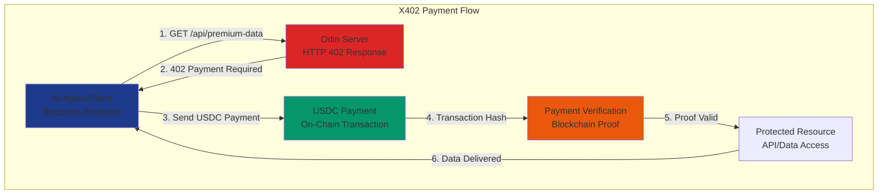
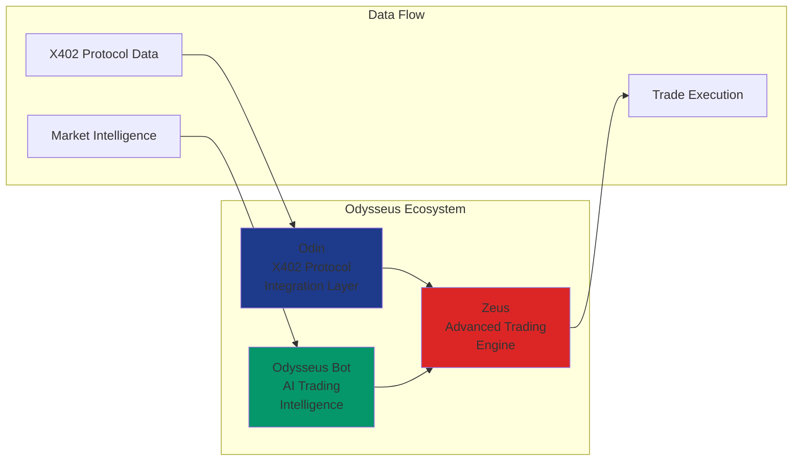
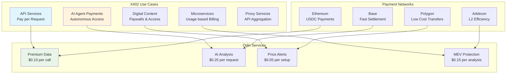
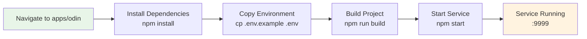
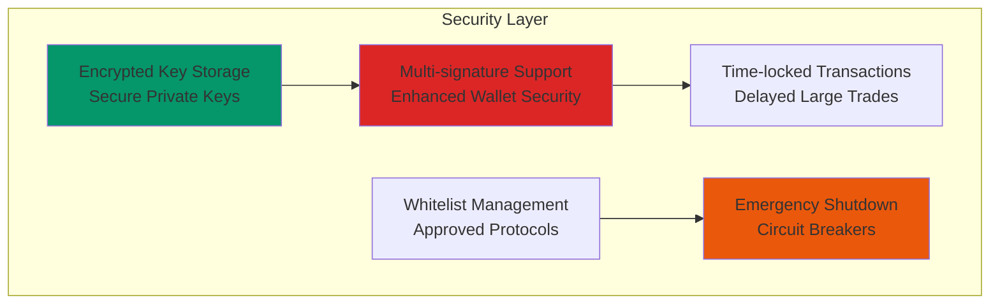
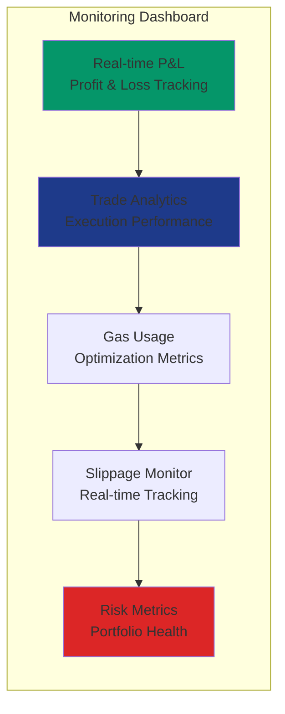

# Odin X402 Protocol Module

> Advanced X402 blockchain integration with Zeus trading engine and Odysseus bot intelligence



## What is X402 Integration?

**X402** is Coinbase's open-source, internet-native payment protocol that uses the dormant **HTTP 402 "Payment Required"** status code to enable programmatic and automatic payments. The Odin module provides comprehensive integration with the X402 payment protocol for AI agents and automated systems.

### X402 Protocol Features:
- **HTTP 402 Payment Required**: Uses standard HTTP status code for payment requests
- **Stablecoin Payments**: Direct USDC payments on Ethereum, Polygon, Base, and Arbitrum
- **Machine-to-Machine Payments**: AI agents can autonomously pay for services
- **Pay-per-Use Billing**: Micropayments for API calls, data access, and digital content
- **Blockchain Verification**: On-chain transaction verification for payment proof
- **No Intermediaries**: Direct payments to recipient wallets without third parties

### Why X402?
X402 enables a modern economy of machine-to-machine payments where AI agents can autonomously pay for web services using stablecoins directly within the web request flow, bypassing traditional payment processors and complex setups.

## Meet the Odysseus Ecosystem



The **Odysseus** platform consists of three primary components working in harmony:

### **Odin** - X402 Protocol Integration Layer
The technical foundation that interfaces with X402 blockchain, handles cross-chain operations, and manages protocol-level integrations.

### **Zeus** - Advanced Trading Engine  
The high-performance trading engine that executes arbitrage, flash loans, options strategies, and portfolio management with military-grade precision.

### **Odysseus Bot** - AI Trading Intelligence
Your conversational AI trading assistant that speaks to you in natural language, interprets market conditions, executes complex strategies, and provides real-time insights. Odysseus is the intelligent interface that makes advanced DeFi trading accessible through simple conversations.

*"Talk to Odysseus, trade with Zeus, powered by Odin's X402 integration."*

## Features



### Core X402 Use Cases
- **Pay-per-API-Call** - Premium market data at $0.10 per request
- **AI Agent Services** - Automated market analysis at $0.25 per analysis
- **Real-time Alerts** - Price monitoring setup at $0.05 per alert
- **MEV Protection Analysis** - Transaction security at $0.15 per analysis
- **Cross-chain Rate Data** - Bridge information at $0.02 per request
- **Micropayment Processing** - Automatic USDC verification and settlement

### Supported Networks
- **Ethereum** - High security, established ecosystem, higher fees
- **Polygon** - Low cost transactions, fast confirmation times
- **Base** - Coinbase L2, optimized for payments, recommended default
- **Arbitrum** - Efficient L2 scaling, good for larger payments

### Payment Features
- **Automatic Verification** - On-chain transaction proof validation
- **Flexible Expiration** - Configurable payment timeouts (default 10 minutes)
- **Multi-Network Support** - Choose optimal network for your use case
- **Direct Settlement** - Payments go directly to recipient wallet

## Quick Start



```bash
cd apps/odin
npm install
cp .env.example .env
npm run build
npm start
```

## Configuration

```env
# X402 Protocol Configuration
X402_RPC_URL=https://x402-mainnet-rpc.com
X402_CHAIN_ID=402
X402_BRIDGE_CONTRACT=0x...
X402_ORACLE_AGGREGATOR=0x...

# Trading Configuration
ODIN_PORT=9999
ODIN_API_KEY=your_secure_api_key
ENABLE_MEV_PROTECTION=true
ENABLE_ARBITRAGE=true
MAX_SLIPPAGE_BPS=100

# Risk Management
MAX_POSITION_SIZE_USD=50000
MAX_DAILY_TRADES=100
STOP_LOSS_PCT=5.0
TAKE_PROFIT_PCT=15.0
```

## API Endpoints

### Health & Status
- `GET /health` - Service health check
- `GET /status` - Detailed system status
- `GET /metrics` - Performance metrics

### X402 Protocol
- `GET /x402/protocols` - List supported X402 protocols
- `GET /x402/bridges` - Available bridge routes
- `POST /x402/bridge` - Execute cross-chain transfer
- `GET /x402/oracles` - Oracle data feeds

### Zeus Trading Engine
- `POST /zeus/arbitrage` - Execute arbitrage opportunity
- `POST /zeus/flash-loan` - Flash loan arbitrage  
- `GET /zeus/opportunities` - Current arbitrage opportunities
- `POST /zeus/portfolio/rebalance` - Portfolio rebalancing
- `GET /zeus/portfolio` - Portfolio overview and performance
- `POST /zeus/execute` - Execute general trading orders

### Risk Management
- `GET /risk/assessment` - Token/protocol risk assessment
- `POST /risk/stop-loss` - Set stop-loss orders
- `GET /risk/exposure` - Current portfolio exposure

## Testing

```bash
npm test                    # Run all tests
npm run test:x402          # Test X402 protocol integration
npm run test:zeus          # Test Zeus trading strategies
npm run test:risk          # Test risk management
./test-odin.sh             # Comprehensive integration testing
```

## Docker

```bash
docker build -t odysseus-odin .
docker run -p 9999:9999 --env-file .env odysseus-odin
```

## Security Features



- **Multi-signature Support** - Enhanced wallet security
- **Time-locked Transactions** - Delayed execution for large trades
- **Whitelist Management** - Approved token/protocol lists
- **Emergency Shutdown** - Circuit breakers for system protection
- **Encrypted Key Storage** - Secure private key management

## Monitoring



- Real-time P&L tracking
- Trade execution analytics
- Gas usage optimization
- Slippage monitoring
- Risk metric dashboards

---

*Part of the Odysseus Trading Platform Ecosystem*