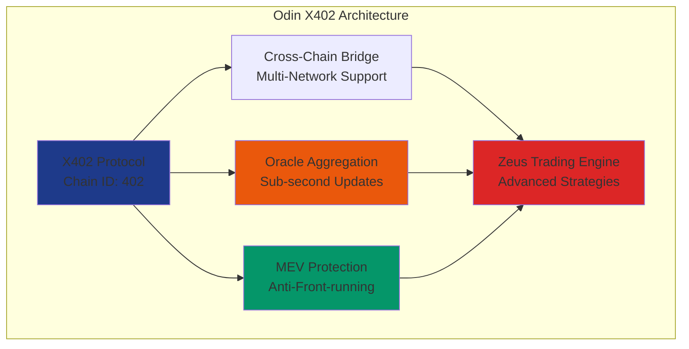
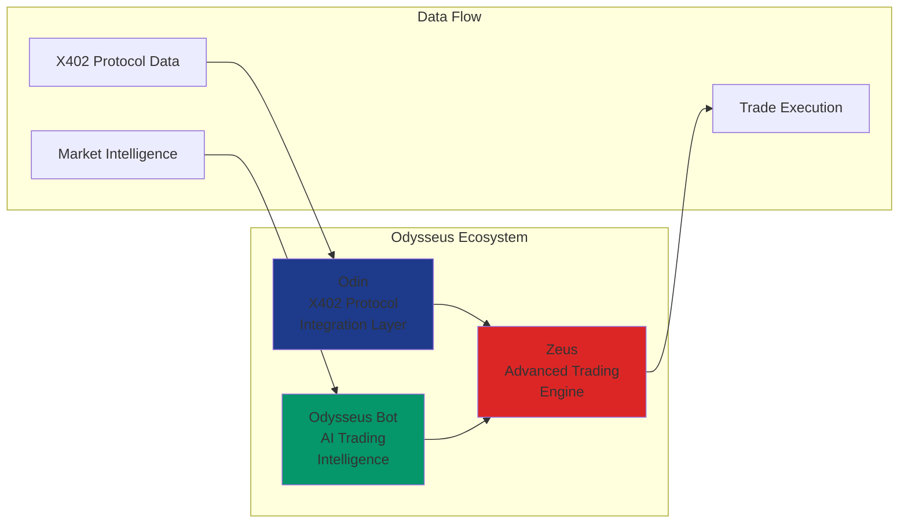
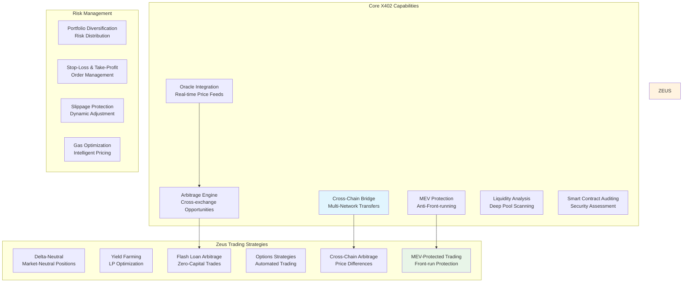
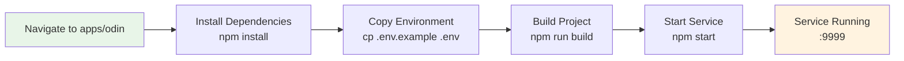
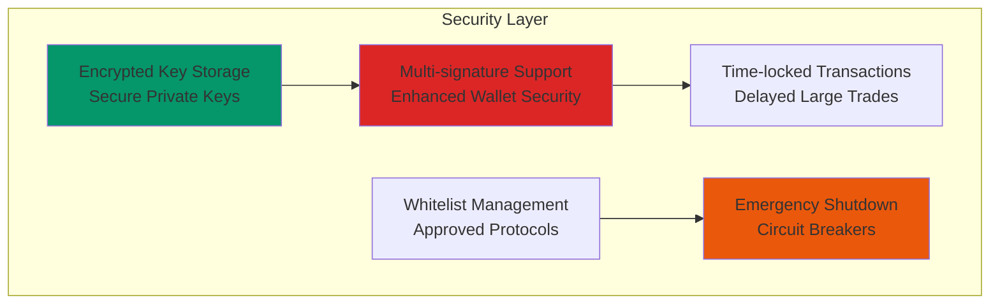
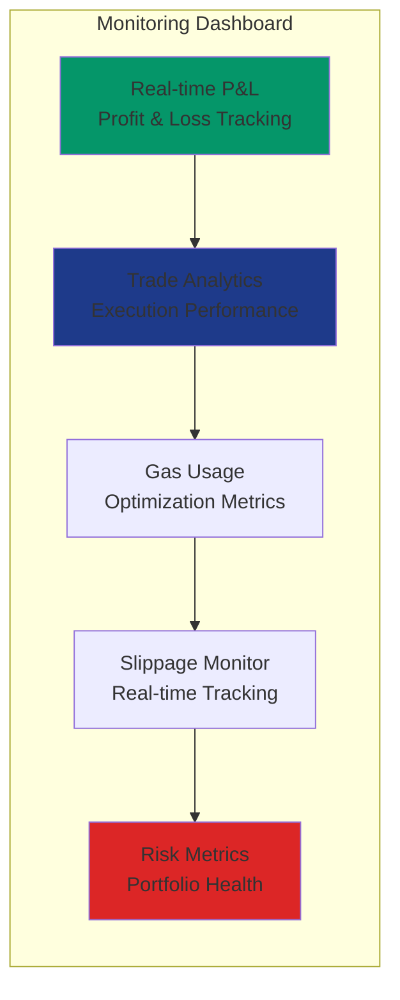

# Odin X402 Protocol Module

> Advanced X402 blockchain integration with Zeus trading engine and Odysseus bot intelligence



## What is X402 Integration?

**X402** is a next-generation blockchain protocol (Chain ID: 402) designed for high-performance DeFi operations with built-in MEV protection and cross-chain interoperability. The Odin module provides comprehensive integration with the X402 ecosystem:

### X402 Protocol Features:
- **Cross-Chain Bridge Network**: Native bridges to Ethereum, Polygon, BSC, Arbitrum, and more
- **Built-in Oracle Aggregation**: Decentralized price feeds with sub-second updates  
- **MEV Protection Layer**: Advanced protection against front-running and sandwich attacks
- **Liquidity Mining Pools**: High-yield farming opportunities with X402 native tokens
- **Smart Contract Auditing**: Automated security assessment for X402-deployed protocols
- **Gas Optimization**: Intelligent transaction batching and gas price optimization

### Why X402?
X402 represents the evolution of DeFi infrastructure, combining the security of Ethereum with the speed of modern Layer-2 solutions while introducing novel MEV protection mechanisms that make it ideal for automated trading strategies.

## Meet the Odysseus Ecosystem



The **Odysseus** platform consists of three primary components working in harmony:

### **Odin** - X402 Protocol Integration Layer
The technical foundation that interfaces with X402 blockchain, handles cross-chain operations, and manages protocol-level integrations.

### **Zeus** - Advanced Trading Engine  
The high-performance trading engine that executes arbitrage, flash loans, options strategies, and portfolio management with military-grade precision.

### **Odysseus Bot** - AI Trading Intelligence
Your conversational AI trading assistant that speaks to you in natural language, interprets market conditions, executes complex strategies, and provides real-time insights. Odysseus is the intelligent interface that makes advanced DeFi trading accessible through simple conversations.

*"Talk to Odysseus, trade with Zeus, powered by Odin's X402 integration."*

## Features



### Core X402 Capabilities
- **Cross-Chain Bridge Operations** - Seamless asset transfers across multiple chains
- **Oracle Integration** - Real-time price feeds and data aggregation
- **MEV Protection** - Anti-front-running and sandwich attack mitigation
- **Arbitrage Engine** - Cross-exchange and cross-chain arbitrage opportunities
- **Liquidity Analysis** - Deep liquidity scanning and pool analysis
- **Smart Contract Auditing** - Automated security assessment for X402 protocols

### Zeus Trading Strategies
- **Delta-Neutral Strategies** - Market-neutral positions with X402 derivatives
- **Yield Farming Optimization** - Automated LP position management
- **Flash Loan Arbitrage** - Zero-capital arbitrage opportunities
- **Options Strategies** - Automated options trading with X402 protocols
- **Cross-Chain Arbitrage** - Exploit price differences across X402 bridges
- **MEV-Protected Trading** - Advanced protection against front-running attacks

### Risk Management
- **Portfolio Diversification** - Automated risk distribution across X402 assets
- **Stop-Loss & Take-Profit** - Advanced order management
- **Slippage Protection** - Dynamic slippage adjustment
- **Gas Optimization** - Intelligent gas price management

## Quick Start



```bash
cd apps/odin
npm install
cp .env.example .env
npm run build
npm start
```

## Configuration

```env
# X402 Protocol Configuration
X402_RPC_URL=https://x402-mainnet-rpc.com
X402_CHAIN_ID=402
X402_BRIDGE_CONTRACT=0x...
X402_ORACLE_AGGREGATOR=0x...

# Trading Configuration
ODIN_PORT=9999
ODIN_API_KEY=your_secure_api_key
ENABLE_MEV_PROTECTION=true
ENABLE_ARBITRAGE=true
MAX_SLIPPAGE_BPS=100

# Risk Management
MAX_POSITION_SIZE_USD=50000
MAX_DAILY_TRADES=100
STOP_LOSS_PCT=5.0
TAKE_PROFIT_PCT=15.0
```

## API Endpoints

### Health & Status
- `GET /health` - Service health check
- `GET /status` - Detailed system status
- `GET /metrics` - Performance metrics

### X402 Protocol
- `GET /x402/protocols` - List supported X402 protocols
- `GET /x402/bridges` - Available bridge routes
- `POST /x402/bridge` - Execute cross-chain transfer
- `GET /x402/oracles` - Oracle data feeds

### Zeus Trading Engine
- `POST /zeus/arbitrage` - Execute arbitrage opportunity
- `POST /zeus/flash-loan` - Flash loan arbitrage  
- `GET /zeus/opportunities` - Current arbitrage opportunities
- `POST /zeus/portfolio/rebalance` - Portfolio rebalancing
- `GET /zeus/portfolio` - Portfolio overview and performance
- `POST /zeus/execute` - Execute general trading orders

### Risk Management
- `GET /risk/assessment` - Token/protocol risk assessment
- `POST /risk/stop-loss` - Set stop-loss orders
- `GET /risk/exposure` - Current portfolio exposure

## Testing

```bash
npm test                    # Run all tests
npm run test:x402          # Test X402 protocol integration
npm run test:zeus          # Test Zeus trading strategies
npm run test:risk          # Test risk management
./test-odin.sh             # Comprehensive integration testing
```

## Docker

```bash
docker build -t odysseus-odin .
docker run -p 9999:9999 --env-file .env odysseus-odin
```

## Security Features



- **Multi-signature Support** - Enhanced wallet security
- **Time-locked Transactions** - Delayed execution for large trades
- **Whitelist Management** - Approved token/protocol lists
- **Emergency Shutdown** - Circuit breakers for system protection
- **Encrypted Key Storage** - Secure private key management

## Monitoring



- Real-time P&L tracking
- Trade execution analytics
- Gas usage optimization
- Slippage monitoring
- Risk metric dashboards

---

*Part of the Odysseus Trading Platform Ecosystem*