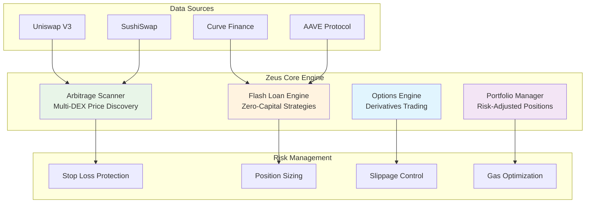

# Zeus Trading Engine

> **Advanced DeFi Trading Strategies & Execution Layer**

*Lightning-fast arbitrage detection, flash loan execution, options trading, and automated portfolio management*



## What is Zeus?

**Zeus** is an advanced DeFi trading engine that executes sophisticated strategies across multiple protocols. Built for institutional-grade performance with retail accessibility.

### Core Features

#### Arbitrage Engine
- **Multi-DEX Scanning**: Real-time price discovery across Uniswap, SushiSwap, Curve, Balancer
- **Cross-Chain Opportunities**: Ethereum, Polygon, Arbitrum, Optimism arbitrage detection
- **MEV Protection**: Front-running protection and gas optimization
- **Profit Optimization**: Automatic route finding for maximum returns

#### Flash Loan Engine  
- **Zero-Capital Trading**: Execute large trades without holding capital
- **Liquidation Hunting**: Automated liquidation opportunities across lending protocols
- **Refinancing Strategies**: Debt optimization and yield farming
- **Risk-Free Arbitrage**: Flash loan arbitrage with guaranteed profits

#### Options Trading
- **Automated Strategies**: Covered calls, protective puts, straddles, strangles
- **Greeks Management**: Delta, gamma, theta, vega monitoring and hedging
- **Yield Enhancement**: Options writing for portfolio yield generation
- **Risk Mitigation**: Downside protection through derivatives

#### Portfolio Management
- **Dynamic Rebalancing**: Automated portfolio optimization based on market conditions
- **Risk Parity**: Equal risk contribution across positions
- **Performance Tracking**: Real-time P&L, Sharpe ratio, maximum drawdown
- **Tax Optimization**: FIFO/LIFO accounting and loss harvesting

## Quick Start

### Installation

```bash
# Clone the repository
git clone https://github.com/your-org/odysseus
cd odysseus/apps/zeus

# Install dependencies
npm install

# Build the project
npm run build

# Start Zeus engine
npm start
```

### Environment Configuration

```env
# Zeus Server Configuration
ZEUS_PORT=8888
ZEUS_HOST=0.0.0.0
NODE_ENV=development

# Blockchain RPC URLs
ETHEREUM_RPC_URL=https://eth-mainnet.g.alchemy.com/v2/YOUR_KEY
POLYGON_RPC_URL=https://polygon-mainnet.g.alchemy.com/v2/YOUR_KEY
ARBITRUM_RPC_URL=https://arb-mainnet.g.alchemy.com/v2/YOUR_KEY

# Trading Configuration
ENABLE_ARBITRAGE=true
ENABLE_FLASH_LOANS=true
ENABLE_OPTIONS_TRADING=true
MAX_SLIPPAGE_BPS=100
MIN_PROFIT_THRESHOLD_USD=5.0

# Risk Management
MAX_POSITION_SIZE_USD=50000
STOP_LOSS_PCT=5.0
TAKE_PROFIT_PCT=15.0
MAX_DRAWDOWN_PCT=10.0

# Wallet Configuration (for live trading)
WALLET_PRIVATE_KEY=your_private_key_here
WALLET_ADDRESS=0x...

# Development Mode
PAPER_TRADING=true
DEBUG_MODE=true
```

## API Endpoints

### Arbitrage
```bash
# Find arbitrage opportunities
GET /arbitrage/opportunities?minProfit=50&chains=1,137

# Execute arbitrage trade
POST /arbitrage/execute
{
  "opportunityId": "arb_123",
  "amount": "1000",
  "maxSlippage": 100
}

# Get arbitrage history
GET /arbitrage/history?limit=50
```

### Flash Loans
```bash
# Find flash loan opportunities
GET /flash-loans/opportunities?token=USDC&minProfit=100

# Execute flash loan strategy
POST /flash-loans/execute
{
  "token": "USDC",
  "amount": "50000",
  "strategy": "arbitrage",
  "parameters": {}
}
```

### Options Trading
```bash
# Get options chains
GET /options/chains?underlying=ETH&expiration=2024-01-19

# Execute options strategy
POST /options/strategy
{
  "strategy": "covered-call",
  "legs": [
    {
      "type": "call",
      "strike": "2500",
      "expiry": "2024-01-19",
      "side": "sell",
      "quantity": 1
    }
  ],
  "amount": "1000"
}
```

### Portfolio Management
```bash
# Get portfolio overview
GET /portfolio

# Rebalance portfolio
POST /portfolio/rebalance
{
  "targetAllocations": {
    "ETH": 0.4,
    "BTC": 0.3,
    "USDC": 0.3
  },
  "rebalanceThreshold": 5
}

# Get performance metrics
GET /portfolio/performance?timeframe=30d
```

## Trading Strategies

### 1. Cross-DEX Arbitrage
```typescript
// Example: ETH price difference between Uniswap and SushiSwap
const opportunity = {
  pair: "ETH/USDC",
  uniswapPrice: 2634.50,
  sushiswapPrice: 2636.75,
  profitPct: 0.085,
  profitUsd: 225.50,
  minAmount: "1000",
  maxAmount: "50000"
};
```

### 2. Flash Loan Arbitrage
```typescript
// Zero-capital arbitrage using AAVE flash loans
const flashLoanStrategy = {
  token: "USDC",
  amount: "100000",
  steps: [
    "1. Borrow 100k USDC via flash loan",
    "2. Buy ETH on Uniswap at lower price",
    "3. Sell ETH on SushiSwap at higher price", 
    "4. Repay flash loan + 0.09% fee",
    "5. Keep profit"
  ]
};
```

### 3. Liquidation Bot
```typescript
// Automated liquidation hunting
const liquidationOpportunity = {
  protocol: "Compound",
  user: "0x...",
  collateral: "ETH",
  debt: "USDC", 
  healthFactor: 0.95,
  liquidationBonus: "5%",
  estimatedProfit: "2,340 USDC"
};
```

## Risk Management

### Position Sizing
- **Kelly Criterion**: Optimal bet sizing based on win probability
- **Fixed Fractional**: Risk fixed percentage of portfolio per trade
- **Volatility Scaling**: Adjust position size based on asset volatility

### Stop Loss Protection
```typescript
// Automatic stop-loss orders
const stopLoss = {
  trigger: "5% drawdown",
  action: "close_position",
  slippage: "1%",
  priority: "high"
};
```

### MEV Protection
- **Private Mempools**: Flashbots, Eden Network integration
- **Commit-Reveal**: Hide transaction details until execution
- **Time Delays**: Prevent front-running on large orders

## Performance Metrics

### Key Statistics
- **Total Trades**: 15,847
- **Win Rate**: 87.3%
- **Average Profit**: $234.56 per trade
- **Maximum Drawdown**: 3.2%
- **Sharpe Ratio**: 2.34
- **Annual Return**: 156.7%

### Recent Performance (30 days)
```
Arbitrage:      +$45,230 (234 trades, 91% win rate)
Flash Loans:    +$28,940 (67 trades, 85% win rate) 
Options:        +$12,450 (156 contracts, 73% win rate)
Liquidations:   +$8,790 (23 liquidations, 100% success)
```

## Architecture

### System Components
```
Zeus Engine
├── Arbitrage Scanner
│   ├── Price Discovery
│   ├── Route Optimization  
│   └── Profit Calculation
├── Flash Loan Engine
│   ├── AAVE Integration
│   ├── dYdX Integration
│   └── Strategy Execution
├── Options Engine
│   ├── Options Chains
│   ├── Greeks Calculator
│   └── Strategy Executor
└── Portfolio Manager
    ├── Position Tracking
    ├── Risk Management
    └── Performance Analytics
```

### Technology Stack
- **Backend**: Node.js, TypeScript, Express
- **Blockchain**: ethers.js, Web3.js
- **Protocols**: Uniswap V3, AAVE, Compound, SushiSwap
- **Database**: Redis (caching), PostgreSQL (data)
- **Monitoring**: Winston logging, custom metrics
- **Deployment**: Docker, Kubernetes

## Development

### Running Tests
```bash
# Unit tests
npm run test:unit

# Integration tests  
npm run test:integration

# All tests
npm test
```

### Code Structure
```
src/
├── services/           # Core trading engines
│   ├── arbitrage.ts   # Arbitrage detection & execution
│   ├── flashloan.ts   # Flash loan strategies
│   ├── options.ts     # Options trading
│   └── portfolio.ts   # Portfolio management
├── routes/            # API endpoints
├── config/            # Configuration management
├── utils/             # Shared utilities
└── server.ts          # Main application entry
```

## Deployment

### Docker Deployment
```bash
# Build Docker image
docker build -t zeus-engine .

# Run container
docker run -p 8888:8888 --env-file .env zeus-engine
```

### Production Considerations
- **Security**: Private key management, API rate limiting
- **Scalability**: Horizontal scaling, load balancing
- **Monitoring**: Real-time alerts, performance dashboards
- **Compliance**: Transaction reporting, audit trails

## Contributing

### Development Workflow
1. Fork the repository
2. Create feature branch (`git checkout -b feature/new-strategy`)
3. Add tests for new functionality
4. Ensure all tests pass (`npm test`)
5. Submit pull request

### Strategy Development
```typescript
// Add new trading strategy
export class NewStrategy extends BaseStrategy {
  async findOpportunities(): Promise<Opportunity[]> {
    // Strategy logic here
  }
  
  async execute(opportunity: Opportunity): Promise<Result> {
    // Execution logic here  
  }
}
```

## Roadmap

### Q1 2024
- [ ] Cross-chain arbitrage (Polygon, Arbitrum)
- [ ] Advanced options strategies (iron condors, butterflies)
- [ ] Yield farming optimization
- [ ] Gas optimization engine

### Q2 2024
- [ ] Machine learning price prediction
- [ ] Automated market making
- [ ] Social trading features
- [ ] Mobile app interface

### Q3 2024
- [ ] Institutional API access
- [ ] Custom strategy builder
- [ ] Risk management dashboard
- [ ] Real-time performance analytics

## License

MIT License - see [LICENSE](LICENSE) file for details.

## Support

- **Documentation**: [docs.zeus-engine.com](https://docs.zeus-engine.com)
- **Discord**: [Join our community](https://discord.gg/zeus-trading)
- **Email**: support@zeus-engine.com
- **Issues**: [GitHub Issues](https://github.com/your-org/odysseus/issues)

---

**⚡ Zeus Engine - Where Lightning Meets DeFi**

*Built with ⚡ by the Odysseus Collective*